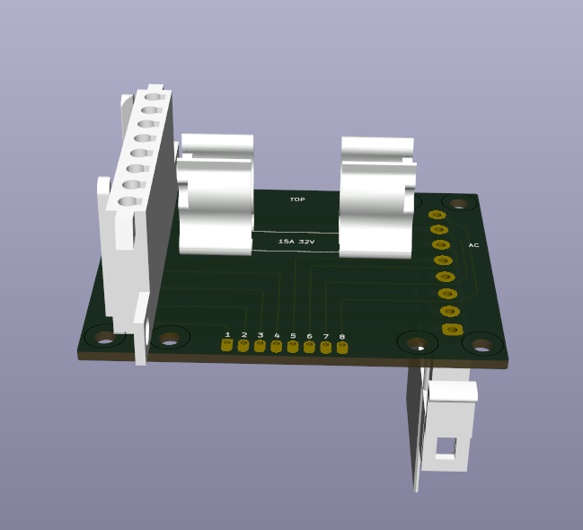
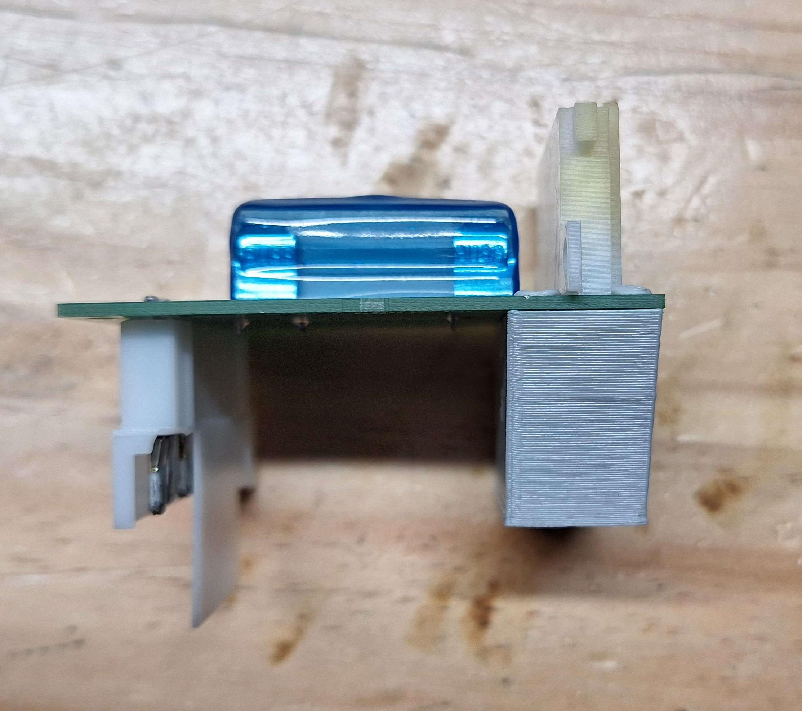
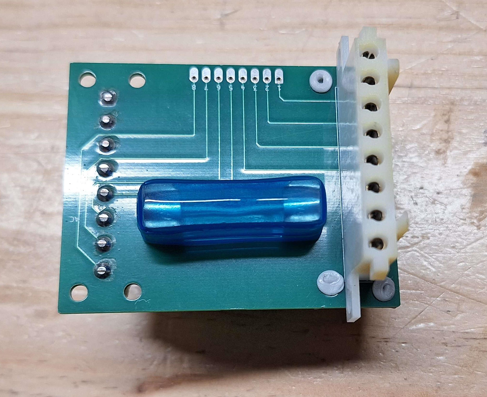
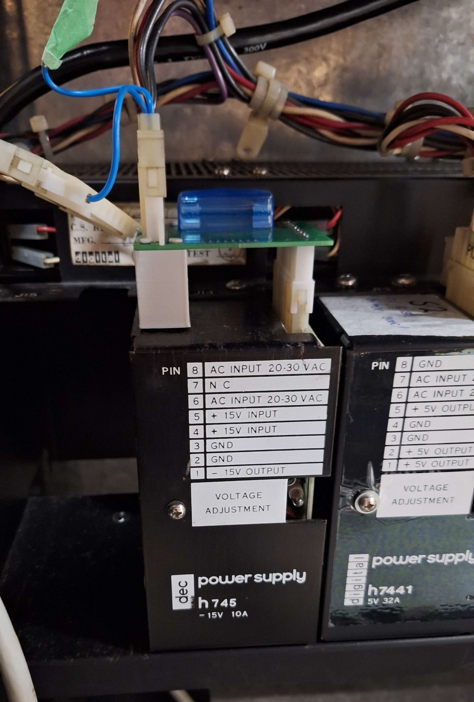

# PDP-11 Regulator Fuse  Board

This is a little fuse board that goes between the DEC h744 and h745.
Both of these regulator modules do not contain any fuses on the AC input, if for example the bridge rectifier fails then the traces on the regulator will explode 💥, that's rather annoying and destructive so this borders to adds a fuse.

Later generation modules shuch as the H7441 include a 32V 15A fuse. 

## BOM
 * 1x [Fuse Cap](https://www.aliexpress.com/item/4000810342695.html) (6*30mm PCB Fuse Holder Cover Fuse Clip)
 * 2x [Fuse Holder](https://www.digikey.co.nz/en/products/detail/eaton-electronics-division/BK-1A1907-06-R/954119)
 * 1x [Fuse 32V 15A](https://www.digikey.co.nz/en/products/detail/littelfuse-inc/0AGC015-V/2519096)
 * 8x [Female Power Pins](https://www.digikey.co.nz/en/products/detail/te-connectivity-amp-connectors/61314-1/290258)
 * 8x [Male Power Pins](https://www.digikey.co.nz/en/products/detail/te-connectivity-amp-connectors/61116-1/290257)
 * Solid Core 16 AWG Wire
 * 1x [3D Printed Stand](https://www.tinkercad.com/things/0jvjAKjBNhU-pdp-fuse-stand)

### Power Connectors

The power connectors can be downloaded as [STL files](https://so-much-stuff.com/pdp8/cad/3d.php) and printed. JLCPCB's resin printing service does a really good job at printing them and cost about $1.50 eash. 

Or you can buy them from here, minimum order quantity is 12:
 * https://www.connectorpeople.com/Connector/TYCO-AMP-TE_CONNECTIVITY/1/1-480460-0
 * https://www.connectorpeople.com/Connector/TYCO-AMP-TE_CONNECTIVITY/1/1-480459-0

## Images

